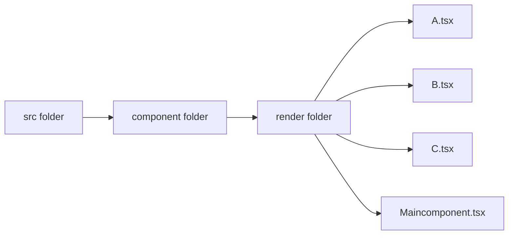
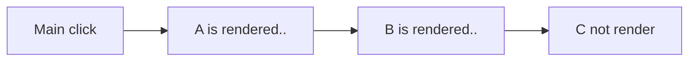
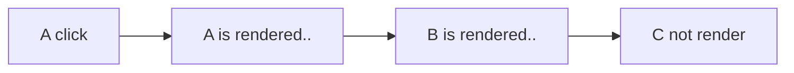
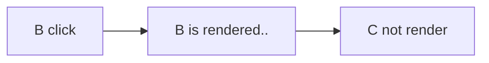
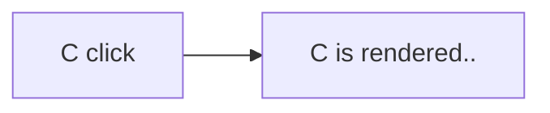

## MSquare Programing Fullstack Course

### Episode-_41_

### Summary For  `Room(1)`  intermediate Class
##
### react မှာ parent component က re-render ဖြစ်ရင် child component တွေပါ လိုက်ပြီး  re-render ဖြစ်ပါတယ်။
- လိုချင်တဲ့ component ကိုပဲ re render ဖြစ်စေပြီး အဲ့ဒီ component မှာ ပါတဲ့ child component ကို re-render မဖြစ်စေချင်ရင် ***memo***  ကို သုံးပေးရပါမယ်။
- component folder ထဲမှာ render ဆိုတဲ့ folder တစ်ခု လုပ်ပြီး `A.tsx` `B.tsx` `C.tsx` `Maincomponent.tsx` ဆိုတဲ့ file  လေးခု လုပ်ပေးပါ။

- သက်ဆိုင်ရာ file  တွေထဲမှာ code တွေ ရေးထည့်ပေးပါ။
```js
//Maincomponent.tsx

import A from './A';

const Main= ()=> {
    const [value,setValue]=useState(0)
  return (
   <div>
     <button onClick={()=> setValue(value +1)}>Main click</button>
     <A/>
   </div>
  )
}
export default Main;
```
```js
//A.tsx

import React, { useState } from 'react'
import B from './B'

const A= ()=> {
    const [value,setValue]=useState(0)
    console.log("A is rendered..")
  return (
   <div>
     <button onClick={()=> setValue(value +1)}>A click</button>
     <B/>
   </div>
  )
}
export default A;
```
```js
//B.tsx

import React, { useState } from 'react'
import C from './C'

const B= ()=> {
    const [value,setValue]=useState(0)
    console.log("B is rendered..")
  return (
   <div>
     <button onClick={()=> setValue(value +1)}>B click</button>
     <C/>
   </div>
  )
}
export default B;
```
```js
//C.tsx

import React, { memo, useState } from 'react'

const C= ()=> {
    const [value,setValue]=useState(0)
    console.log("C is rendered..")
  return (
    <button onClick={()=> setValue(value +1)}> C click</button>
  )
}
export default memo(C);
```
- Maincomponent.tsx မှာ  A component ကို child  component အဖြစ် ထည့်ပေးထားပါတယ်။
-  A.tsx မှာ  B component ကို child  component အဖြစ် ထည့်ပေးထားပါတယ်။
- B.tsx မှာ  C component ကို child  component အဖြစ် ထည့်ပေးထားပါတယ်။
- C component ကို export လုပ်ထားတဲ့နေရာမှာ memo ကို အသုံးပြုထားပါတယ်
- component တစ်ခုဆီမှာ log တွေထုတ်ပေးပါတယ်။
- Main component ကို  App.tsx မှာ child  component အဖြစ် ထည့်ပေးလိုက်ပါမယ်။
```js
//App.tsx --> return section
  return (
    <div className="App">
      {/* <DatePicker
        value={value}
        handleDateChange={setValue}
        availability={availability}
      />
      <TimePicker availability={availability} /> */}
      <Main/>
    </div>
  );
```
- react app ကို start လုပ်ပြီး button တွေကို click လုပ်ကြည့်ပါက parent component တွေ render လုပ်နေလည်း C component က re -render မဖြစ်တာကို တွေ့ရမှာ ဖြစ်ပါတယ်





##
### Conditionally Display steps in one component
- react မှာ အခြေအနေ ပေါ် မူတည်ပြီး return ပြန်ချင်တဲ့ component ကို ထိန်းချုပ်လို့ ရပါတယ်။
```js
//App.tsx

import React, { useEffect, useState } from "react";
import "./App.css";
import DatePicker from "./components/DatePicker";

import TimePicker, { Availability } from "./components/TimePicker/TimePicker";
import dayjs, { Dayjs } from "dayjs";
import Main from "./components/render/MainComponent";

function App() {


// const [value, setValue] = useState<Dayjs | null>(dayjs());
// const [availability, setAvilability] = useState<Availability[]>();

//   useEffect(() => {
//     fetchData(value);
//   }, [value]);

//   const fetchData = async (date: Dayjs | null) => {
//     const choosenDate = date?.format("DD-MM-YYYY");

    
//     const url = `http://localhost:5000/available?month=${value?.month()}`;
//     const response = await fetch(url);
//     const data = await response.json();

    
//     setAvilability(data);
//   };

  //set step state
  const [step,setStep]= useState(1)

  return(
    <div>
      <button onClick={ ()=> setStep(step +1)}>Set Step</button>
      {step === 1 && <h1>Step 1</h1>}
      {step === 2 && <h1>Step 2</h1>}
      {step === 3 && <h1>Step 3</h1>}
      
    </div>
  )
  // return (
  //   <div className="App">
  //     {/* <DatePicker
  //       value={value}
  //       handleDateChange={setValue}
  //       availability={availability}
  //     />

      
  //     <TimePicker availability={availability} /> */}
  //     <Main/>
  //   </div>
  // );
}

export default App;


```
- App.tsx မှာ ခု သင်ခန်းစာ နမူနာမှာ မလိုသေးတဲ့ code တစ်ချို့ကို ခနပိတ်ထားပါတယ်
```js
 //set step state
  const [step,setStep]= useState(1)

  return(
    <div>
      <button onClick={ ()=> setStep(step +1)}>Set Step</button>
      {step === 1 && <h1>Step 1</h1>}
      {step === 2 && <h1>Step 2</h1>}
      {step === 3 && <h1>Step 3</h1>}
      
    </div>
  )
  ```
  - step state  တစ်ခုလုပ်ထားပါတယ်
  - return လုပ်တဲ့အခါ button တစ်ခု ထည့်ပေးထားပြီး click လုပ်တိုင်း setStep ကို ခေါ်ပေးထားပါတယ်။
  - အောက်မှာတော့ step ရဲ့ တန်ဖိုးကို စစ်လိုက်ပြီး true ဖြစ်တဲ့ h1 tag ကို   return လုပ်ပေးလိုက်တာဖြစ်ပါတယ်
  - react app မှာ set step ခလုတ်ကို နှိပ်ပြီး စမ်းကြည့်လိုက်ပါက step ရဲ့ တန်ဖိုးအလိုက် သက်ဆိုင်တဲ့ h1 tag ကိုပဲ ပြပေးတာ မြင်ရမှာပါ
  - ဒီနည်းနဲ့ react component တစ်ခုမှာ အခြေအနေကို စစ်ပြီး ပြချင်တဲ့ child component ကို ထိန်းချုပ်လို့ရပါတယ်။
  ##
  ### Try this
  https://mui.com/material-ui/react-stepper/#linear
  - အပေါ်က link က stepper ကို လေ့လာပြီး မိမိတို့ react app မှာ link ထဲက stepper အတိုင်း ပြနိုင်အောင် စမ်းကြည့်ကြပါ။
