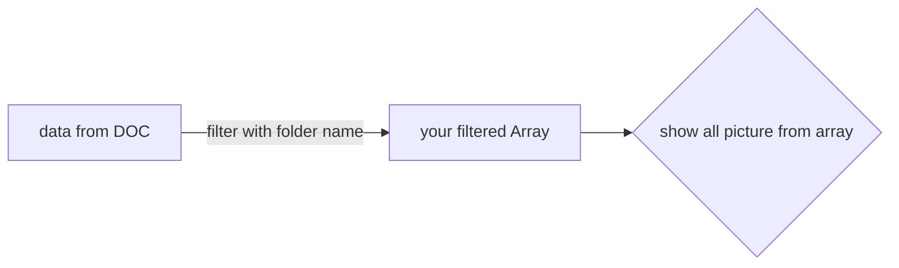

## MSquare Programing Fullstack Course
### Episode-*41* Summary for (group 2) 

ဒီနေ့သင်တန်းမှာတော့ <br>

###  digital ocean space server ဆီ back-end ကနေ request send ခြင်း


ကို လေ့လာသွားပါမယ်။
##
### အရင်သင်ခန်းစာမှာတော့ postman ကနေ authorization နဲ့ key တွေ ထည့်ပြီး request လုပ်ခဲ့ပါတယ်။
- ဒီနေ့သင်ခန်းစာမှာတော့ ကျနော်တို့ရဲ့ back-end server ကနေ DOC ဆီ request လုပ်ပြီး data လှမ်းယူပါမယ်
- အရင်ဆုံး project folder အသစ်တစ်ခု လုပ်ပါ
`mkdir doc-contents && cd doc-contents`

- project folderrမှာ index.js နဲ့ s3client.js ဖိုင် နှစ်ခုလုပ်ပါ။
`touch index.js s3client.js`

- လုပ်ထားတဲ့ project folder ထဲ npm init လုပ်ပေးပါ
`npm init -y`

- aws s3 client module တစ်ခု install လုပ်ပေးပါ။
`npm i @aws-sdk/client-s3`

```console
// Terminal 

aungm@MSquare MINGW64 ~/Documents
$ mkdir doc-contents && cd doc-contents

aungm@MSquare MINGW64 ~/Documents/doc-contents
$ touch index.js s3client.js

aungm@MSquare MINGW64 ~/Documents/doc-contents
$ npm init -y
Wrote to C:\Users\aungm\Documents\doc-contents\package.json:

{
  "name": "doc-contents",
  "version": "1.0.0",
  "description": "",
  "main": "index.js",
  "scripts": {
    "test": "echo \"Error: no test specified\" && exit 1"
  },
  "keywords": [],
  "author": "",
  "license": "ISC"
}

aungm@MSquare MINGW64 ~/Documents/doc-contents
$ npm i @aws-sdk/client-s3

added 101 packages, and audited 102 packages in 7s

1 package is looking for funding
  run `npm fund` for details

found 0 vulnerabilities

```
##
- **package.json** ထဲမှာ `"type":"module"` ထည့်ပေးပါ
```js
{
  "name": "doc-contents",
  "version": "1.0.0",
  "description": "",
  "main": "index.js",
  "type": "module",
  "scripts": {
    "test": "echo \"Error: no test specified\" && exit 1"
  },
  "keywords": [],
  "author": "",
  "license": "ISC",
  "dependencies": {
    "@aws-sdk/client-s3": "^3.293.0"
  }
}
```
- `"type":"module"`ထည့်ပေးလိုက်တာမလို့  node module တွေ သုံးတဲ့ အခါ require အစား import ကို အသုံးပြုလို့ ရပြီး ဖြစ်ပါတယ်။
- s3client.js မှာ code တစ်ချို့ ထည့်ပါမယ်။
```js
// s3client.js

import { S3 } from "@aws-sdk/client-s3";

const s3Client = new S3({
  endpoint: "https://sgp1.digitaloceanspaces.com/",
  region: "asia",
  credentials: {
    accessKeyId: "DO00AKAWLRVPT3XBKMQC",
    secretAccessKey: "Sz9cmmtb0csW6MccES3kTAqxwWZJ8hMqdE42xg19OiA",
  },
});

export { s3Client };
```
- s3Client တစ်ခု create လုပ်ထားပြီး export လုပ်ထားတာပါ။
- export လုပ်ထားတာမလို့ s3Client ကို index.js မှာ import လုပ်ပြီး အသုံးပြုနိုင်ပါတယ်။
```js
// index.js

// Imports your configured client and any necessary S3 commands.
import { ListObjectsCommand } from "@aws-sdk/client-s3";
import { s3Client } from "./s3Client.js";

// Specifies a path within your bucket, e.g. example-bucket-name/example-directory.
const bucketParams = { Bucket: "msquarefdc" };

// Returns a list of objects in your specified path.
const run = async () => {
  try {
    const data = await s3Client.send(new ListObjectsCommand(bucketParams));
    console.log("Success", data);
    return data;
  } catch (err) {
    console.log("Error", err);
  }
};

run();
```
>ရှင်းလင်းချက်
```js
import { ListObjectsCommand } from "@aws-sdk/client-s3";
import { s3Client } from "./s3Client.js";
```

- ListObjectsCommand နဲ့ s3Client  ကို လှမ်းယူထည့်လိုက်တာပါ။
```js
const bucketParams = { Bucket: "msquarefdc" };
```
- bucketParams ဆိုတဲ့ variable တစ်ခုထဲမှာ သုံးမယ့် Bucket အမည်ကို သိမ်းလိုက်တာဖြစ်ပါတယ်။
```js
const run = async () => {
  try {
    const data = await s3Client.send(new ListObjectsCommand(bucketParams));
    console.log("Success", data);
    return data;
  } catch (err) {
    console.log("Error", err);
  }
};

run();
```
-run ဆိုတဲ့ function ထဲမှာ s3Client.send() ကို အသုံးပြုပြီး DOC space bucket ဆီ request လုပ်လိုက်ပါတယ်
- response ပြန်လာတဲ့ data ကို log ထုတ်ထားပြီး အကယ်၍ error ဖြစ်ခဲ့ရင် error ကို  log ပြပေး ဖို့ လုပ်ထားတာပါ။
- ခု terminal ထဲမှာ node index.js ကို run ပေးလိုက်တဲ့အခါ  response ပြန်လာတဲ့ data တွေကို log   ထုတ်ပေးတာ မြင်ရမှာ ဖြစ်ပါတယ်။
##
### Try this
- response ပြန်လာတဲ့ data တွေကို အသုံးပြုပြီး
- မိမိ folder နာမည်ကို filter လုပ်ပြီး folder ထဲက ပုံတွေကို UI မှာပြနိုင်အောင် လုပ်ကြည့်ကြပါ။
example :

